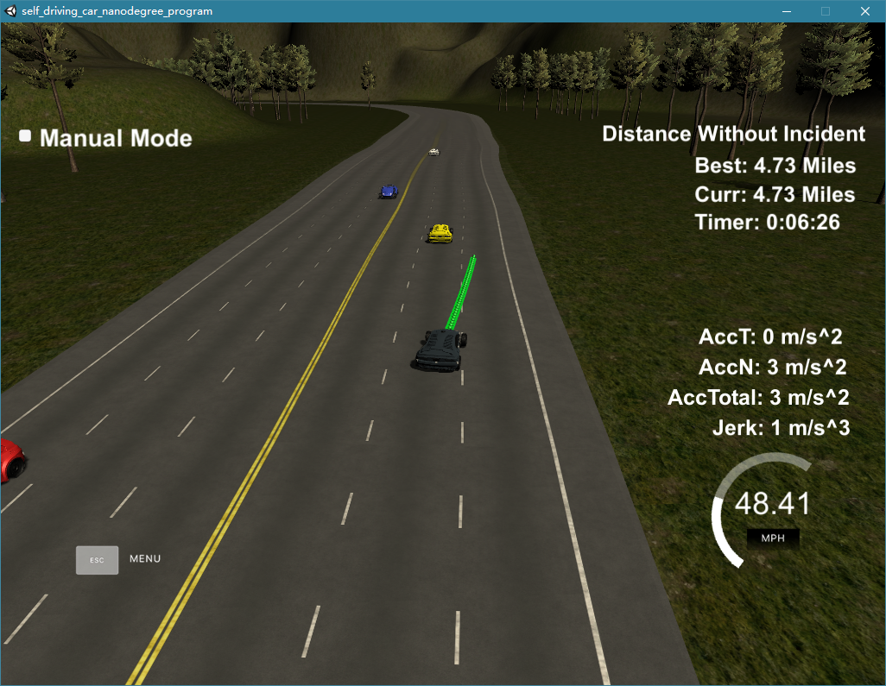

# **CarND-Path-Planning-Project**

---

##Goals:

In this project your goal is to safely navigate around a virtual highway with other traffic that is driving +-10 MPH of the 50 MPH speed limit.
You will be provided the car's localization and sensor fusion data, there is also a sparse map list of waypoints around the highway.
The car should try to go as close as possible to the 50 MPH speed limit, which means passing slower traffic when possible, note that other cars will try to change lanes too.
The car should avoid hitting other cars at all cost as well as driving inside of the marked road lanes at all times, unless going from one lane to another.
The car should be able to make one complete loop around the 6946m highway. Since the car is trying to go 50 MPH, it should take a little over 5 minutes to complete 1 loop.
Also the car should not experience total acceleration over 10 m/s^2 and jerk that is greater than 10 m/s^3.

[//]: # (Image References)

## Rubric Points
### Here I will consider the [rubric points](https://review.udacity.com/#!/rubrics/1020/view) individually and describe how I addressed each point in my implementation.

### Compilation

#### 1. Code must compile without errors with `cmake` and `make`.

My project includes the following files:
* src/helpers.h : helper functions used in some places
* src/spline.h : the spline function from the Tips section
* src/json.hpp : library for handling json
* src/main.cpp : main source file containig the main loop

I added the source files to the CMakeFiles.txt so everything should compile fine.

### Valid Trajectories

#### 1. The car is able to drive at least 4.32 miles without incident..

My car drives more than 4.32 miles without incident...

#### 2. The car drives according to the speed limit.

My car never exceeds the speed limit : 50 MPH.

#### 3. Max Acceleration and Jerk are not Exceeded.

Acceleration and Jerk are not exceeded.

#### 4. Car does not have collisions.

My car did not come into contact with any of the other cars on the road.

#### 5. The car stays in its lane, except for the time between changing lanes.

My car doesn't spend more than a 3 second length out side the lane lanes during changing lanes, and every other time the car stays inside one of the 3 lanes on the right hand side of the road.

#### The car is able to change lanes

My car is able to smoothly change lanes when it makes sense to do so, such as when behind a slower moving car and an adjacent lane is clear of other traffic.

### Reflection

#### There is a reflection on how to generate paths.
see [README](./README.md)
